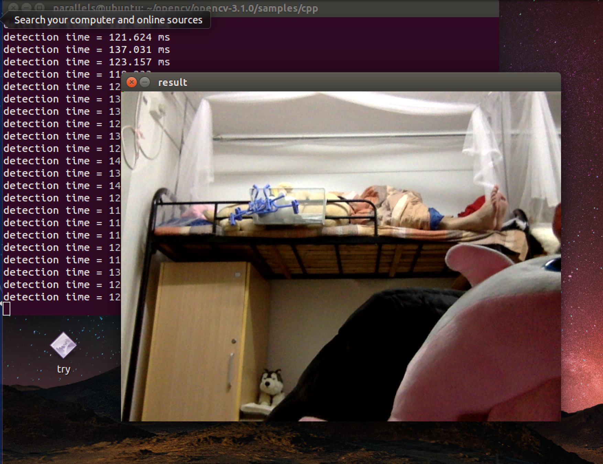

#OpenCV3.1 installation based on Ubuntu 14.04
*ok... it takes me much time to configure the OpenCV development enviornment.*

## some packages to install

```c++
sudo apt-get install build-essential
sudo apt-get install cmake git libgtk2.0-dev pkg-config libavcodec-dev libavformat-dev libswscale-dev
sudo apt-get install python-dev python-numpy libtbb2 libtbb-dev libjpeg-dev libpng-dev libtiff-dev libjasper-dev libdc1394-22-dev
```

## get OpenCV source code

opencv-3.1.0.zip [http://opencv.org/downloads.html](http://opencv.org/downloads.html)

ippicv_linux_20151201.tgz  

## installation steps

```c++
mkdir opencv
cd ./opencv
cp ~/downloads/opencv-3.1.0.zip ./
unzip opencv-3.1.0.zip
cd opencv-3.1.0
mkdir build
cd build
```

because ippicv often has problem to install, so we copy the file we have download to ```~/opencv/opencv-3.1.0/3rdparty/ippicv/downloads/linux-808b791a6eac9ed78d32a7666804320e/``` if the directory does not exist, mkdir.

```c++
cmake -D CMAKE_BUILD_TYPE=RELEASE -D CMAKE_INSTALL_PREFIX=/usr/local ..
make 
sudo make install 

sudo vim /etc/ld.so.conf
add include /usr/local/lib to file

sudo Idconfig -v
export PKG_CONFIG_PATH=$PKG_CONFIG_PATH:/usr/local/lib/pkgconfig 
```

after that, you may still **meet bugs**.  I copy the **libippicv.a** which is in ~/opencv/opencv-3.1.0/3rdparty/ippicv/unpack/ippicv_lnx/lib/intel64 to the /usr/local/lib.

## test samples

opencv has many samples to test if opencv has been installed correctly. I choose the g++ to compile the program, you can also use Cmake.

```c++
cd ~/opencv/opencv-3.1.0/samples/cpp
g++ facedetect.cpp -o facedetect `pkg-config --cflags --libs opencv`
./facedetect
```

**demo screen**

 


(ok… .um …..   there is no face …….)


